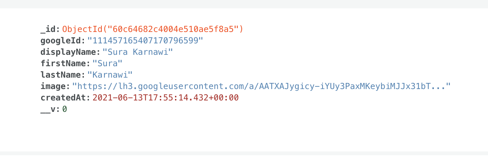
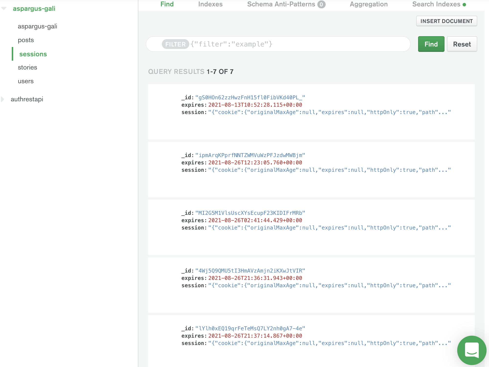
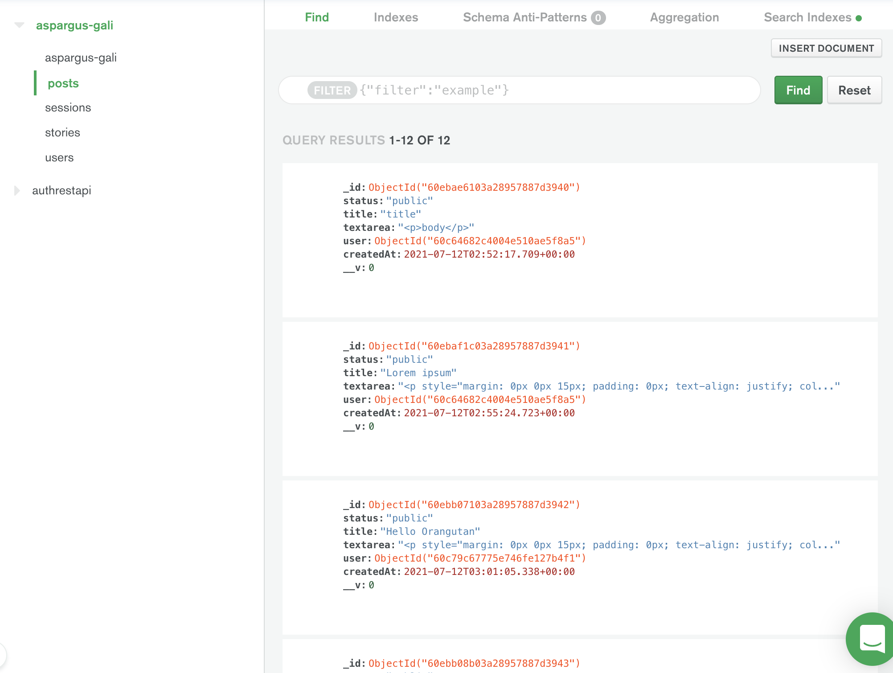

# Creating posts public and private using Google authentication oauth
## by Sura K

### To do next! 
* DON'T commit Readme or config.env
* add config.env to ignore files

## How to run
* `npm install`
* create google app and link it
* `npm run dev`
* It runs on `localhost:9900`
* Don't commit config.env use your OWN keys

# List all possible routes
* * GET "/" root you will see home page. You can't 'Add post' if you're not logged in
* * GET "/dashboard" Dashboard, once you've logged in you'll be redirected to dashboard where you will see all your own posts
* * GET "/posts" display all public posts of your and others
* * "/posts/add" add posts
* * "/posts/edit" edit post, if the use who's logged in is the same one as the author of the post 
* * "posts/id" display id, display one speicifc post with that requested id. 
* * "posts/user/Id"
### Layouts
* * login and main

## The app is doing the following
* localhost:9900/login it performs oAuth with google api, and it addes user to database mongoDB 
* If you've logged in it takes you to dashboard
* If you aren't logged in (not authenticated) and try access Dashboard it takes you to login page
* * It stores session in database
* On Loging and authentication it saves google profile id
* Gets the name from the request on /dashboard route

# To be improved
* * trucate and textarea show all text area or show html look at it. Test if you can save html tag free textarea by changing settings of ckeditor
* * error on update related to post route you can compare to story how they did PUT, minute 2:10 edit page add form, method override, understand public and private chart
* * npm bootstrap package was installed, needs to be 
* * added public post minute 1:51 add global user for the post edit, fix body textarea where all shows
* * Logout works but it doens't clear cookie or session - You can fix
* Style pretty up the navigation menu and the styles and the pages
* edit page form - choose the right classes
* move add post link to the right place
* * Just understand how in edit.hbs the action is /posts/{{post._id}} where did we get it from how we can see the data of the post. 
* fix login layout
* Dashboard shows all user public and private posts, but posts doesn't show private posts of the user that's logged in, only public
* * Mongoose assigns each of your schemas an id virtual getter by default which returns the documents _id field

# Things I did

* refactured code so there's no repetition of calling the same middleware of authentication, just moved it up and called middleware one time at the `/post` level
* Added mongodb new cluster collection https://cloud.mongodb.com/ > aspargus-gali collection it has users. The users are the ones we sign up with. 

* Change handlebars template materialize css and jquery (done) > make the navbar activaited with javasccript. 

* Make sure .env files aren't committed

* Module exports vs export default
require a package vs import from 

* Add screenshot or gif on what the project does
* Hide your keys    
* It uses 'npm method override' to override the default state of not taking methods of delete and put. So we add hidden input field with modifier value as put/delete. The alternative to use XMLHttpRequest,fetch/axios/jQuery(Ajax) in the frontend.

* * * Refactored: posts routes and double checked everything works- well done. moved out authentication middleware to index.js rather than app.js, remove the repeated call of the middleware to index.js

## MongoDB
* User details db 
* session db 
* posts db 

